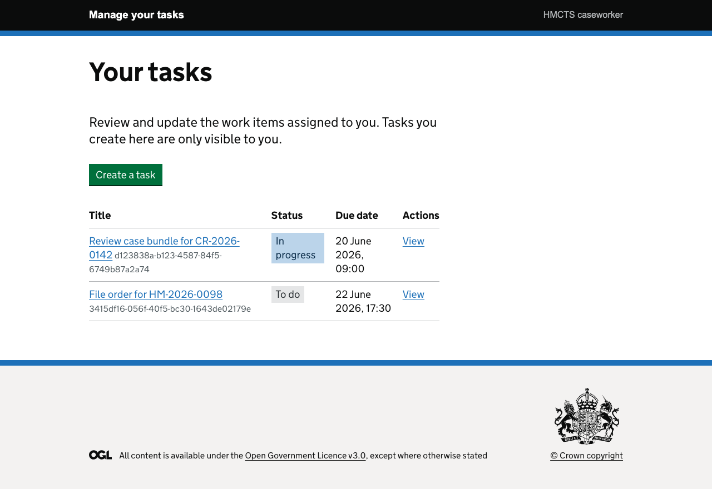
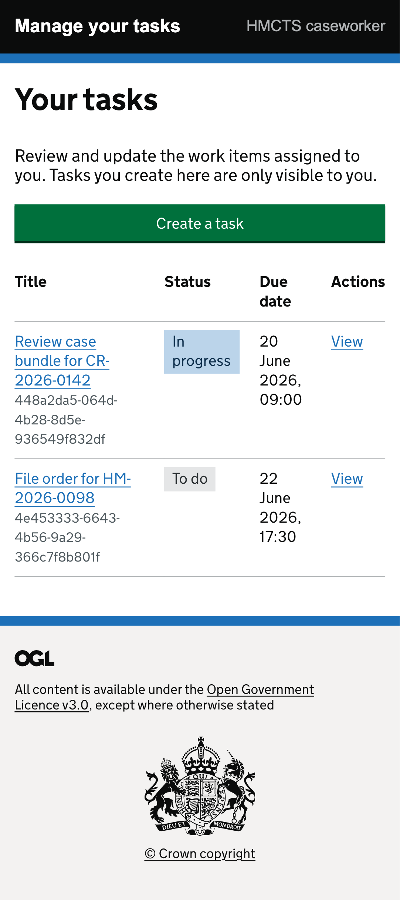

# Manage your tasks - DTS developer technical test

[](https://github.com/ThomasJButler/dts-developer-challenge/actions/workflows/ci.yml)

A small caseworker task-management system built for the HMCTS DTS developer technical test. The original brief is preserved verbatim at [`docs/brief.md`](docs/brief.md).

## Screenshots

| Desktop | Mobile |
|---------|--------|
|  |  |

## Stack

- **Backend** - Python 3.11, FastAPI, SQLAlchemy 2, Alembic, Pydantic v2, PostgreSQL 16. Tested with pytest and httpx.
- **Frontend** - Node 22, Express, Nunjucks, [GOV.UK Frontend](https://frontend.design-system.service.gov.uk/). Server-rendered, no client-side framework. Tested with Mocha, Chai, Supertest, Playwright and axe-core.
- **Infrastructure** - Docker Compose orchestrates the database, backend and frontend. GitHub Actions runs the linters, unit suites and end-to-end suite on every push.

I chose GOV.UK Frontend deliberately. My usual stack is React, Next.js and ShadCN, but the assessment is for an HMCTS role, so working in the actual public-sector design system felt like the right thing to pick up. It ended up being one of the most enjoyable parts of the build - the components are well thought through, the accessibility is baked in, and the UX language transfers directly from real government services. Good front-end matters to me, and the design system makes the right thing the easy thing.

## Running it

```bash
git clone https://github.com/ThomasJButler/dts-developer-challenge.git
cd dts-developer-challenge
cp .env.example .env
docker compose up --build
```

- Frontend: <http://localhost:3000>
- API: <http://localhost:8000>
- API docs (Swagger): <http://localhost:8000/docs>
- API docs (ReDoc): <http://localhost:8000/redoc>

The manual end-to-end smoke checklist lives at [`docs/smoke.md`](docs/smoke.md).

## Testing

```bash
# Backend (needs Postgres on localhost:5432 - `docker compose up -d db` is enough)
cd backend
source .venv/bin/activate
pip install -r requirements.txt -r requirements-dev.txt
ruff check . && ruff format --check . && pytest

# Frontend unit + lint
cd ../frontend
npm install
npm run lint
npm test

# Frontend end-to-end (drives a real browser against the running stack)
npm run e2e:install   # one-time Chromium download
npm run e2e
```

The end-to-end suite covers the golden CRUD path, server-side validation, and WCAG 2.1 AA assertions via axe-core. To regenerate the screenshots embedded above:

```bash
npm run e2e:screenshots
```

## How this was built

I built this top-down with TDD, using Claude Opus 4.7 and Claude Design as collaborators throughout. Each task lived in its own branch (`feature/<trunk>-<slug>`), every PR got a Claude-driven code review before merge, and I walked through each one manually in the browser before ticking it off. The planning prompts I used are kept in [`docs/planning/prompts/`](docs/planning/prompts/) so the process is fully visible.

A few notes on what's intentional:

- The unit and end-to-end tests are left in on purpose. The brief asks for them, and as a code assessment they're meant to be read - they document the contract as much as they verify it.
- Migrations are mandatory; there's no `Base.metadata.create_all` shortcut. Alembic is the only path that touches schema, so the production parity story holds.
- The API contract (`docs/api.md`) is the integration seam. The backend defines OpenAPI; the frontend consumes it via a typed HTTP client. When endpoints change, that document changes first.
- The frontend has no business logic of its own - it's a thin server-rendered client over the backend. Caseworkers see a GOV.UK page, the page asks the API, the API answers. That's it.
- Times are stored as UTC and rendered as Europe/London. Caseworkers operate in London; the API contract stays unambiguous.

## Docs

- [`docs/brief.md`](docs/brief.md) - the original assessment brief, verbatim.
- [`docs/api.md`](docs/api.md) - REST API contract: endpoints, request and response shapes, status codes.
- [`docs/smoke.md`](docs/smoke.md) - manual end-to-end checklist.
- [`docs/backend/`](docs/backend/) - backend architecture, data model, request flow, ADR-style decision log.
- [`docs/design-handoff/`](docs/design-handoff/) - the Claude Design reference bundle: GOV.UK spec annotations, clickable HTML prototype, and the seven screen states the build was recreated from.
- [`docs/planning/`](docs/planning/) - trunk-level plans plus every AI prompt I used during the build.

## Licence

This is an assessment submission. No licence - the code is provided for review purposes only.
